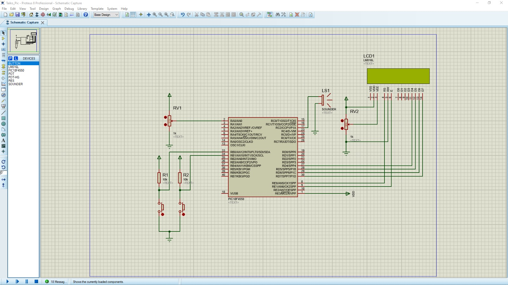
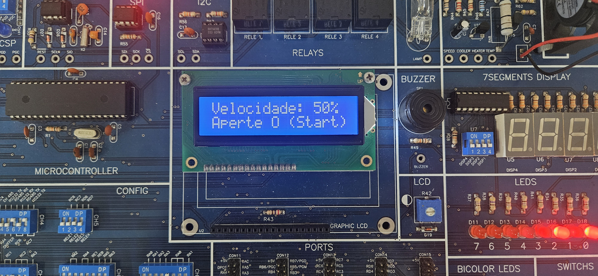
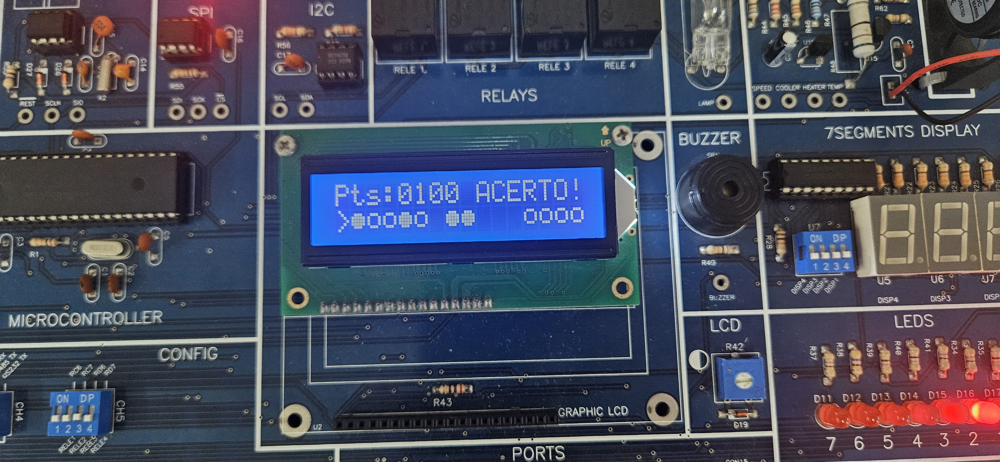
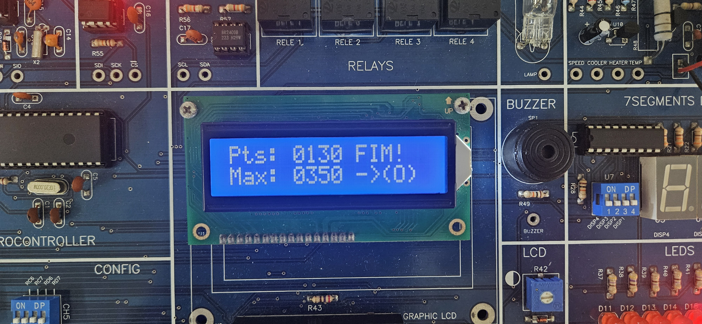

# 🥁 Taiko PIC: 8-bit Rhythm Game on PIC18F4550

An embedded interactive rhythm game inspired by "Taiko no Tatsujin," developed entirely in C for the **Microchip PIC18F4550** microcontroller. This academic project demonstrates low-level hardware integration, combining real-time visual rendering on a character LCD with 8-bit PWM audio synthesis.

## ⚙️ Core Architecture & Features
*   **Game Engine (Timer0):** Frame rate and graphical asset movement are precisely paced by Timer0 16-bit overflows, calculated mathematically to ensure visual consistency.
*   **Audio Synthesizer (CCP1 & Timer2):** Real-time generation of square-wave musical notes (PWM) at 50% duty cycle, emulating retro 8-bit sound chips. Implemented staccato logic via dynamic duty cycle manipulation.
*   **Hardware Interpolation (ADC):** A potentiometer acts as the difficulty selector. The 10-bit analog conversion is linearly interpolated into the Timer0 payload via extended variable math, adjusting the game's speed in real-time.
*   **Hit Detection (External Interrupts):** User inputs (INT0 and INT1) are decoupled from the main loop. Falling edge interrupts assess the collision zone matrix in microseconds to guarantee zero input lag.
*   **Non-Volatile Memory (EEPROM):** Bitwise slicing is used to store the 16-bit high score integer across two 8-bit EEPROM addresses, ensuring record persistence between power cycles.

## 🛠️ Technologies Used
*   **Microcontroller:** Microchip PIC18F4550 (20MHz Fosc)
*   **Language:** C (XC8 Compiler)
*   **IDE & Simulation:** MPLAB X IDE & Proteus Design Suite
*   **Hardware Platform:** EXSTO XM118 Educational Kit

## 📸 Schematics & Hardware Execution

  
   
  <em>System schematic developed in Proteus demonstrating the LCD and peripheral connections.</em>

 

  
  
  
   
  <em>Functional prototype running on the EXSTO XM118 platform.</em>

## 📄 Documentation
For a deep dive into the mathematical models used for PWM frequencies and Timer calculations, please refer to the complete Academic Report (in Portuguese) included in this repository: [Relatório_projeto_Sist_Micro.pdf](Relatório_projeto_Sist_Micro.pdf)

---
*Project developed by Luan Tarumoto de Macedo for the Embedded Systems (Sistemas Microcontrolados) course at UTFPR.*
